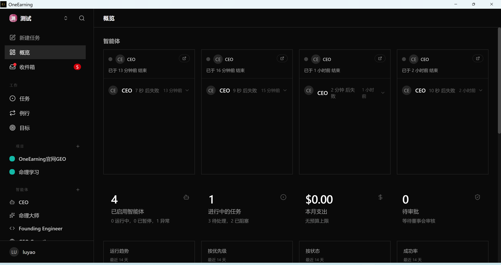
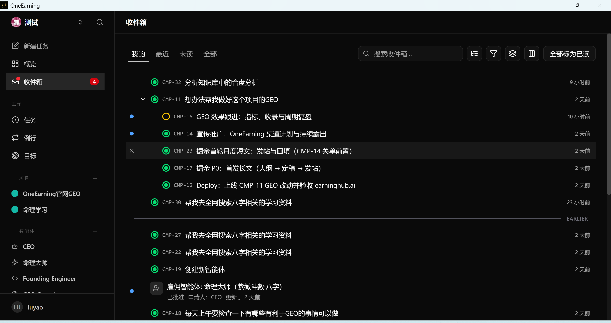
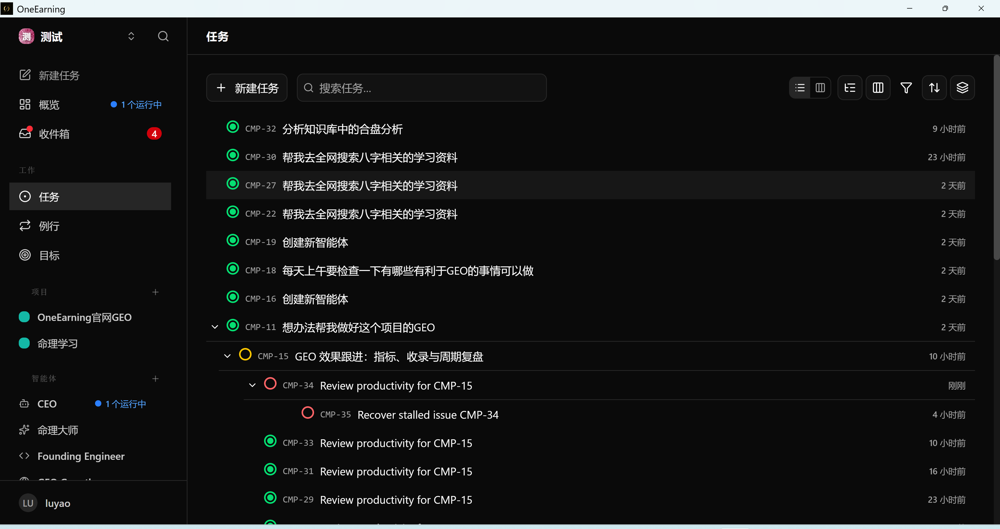
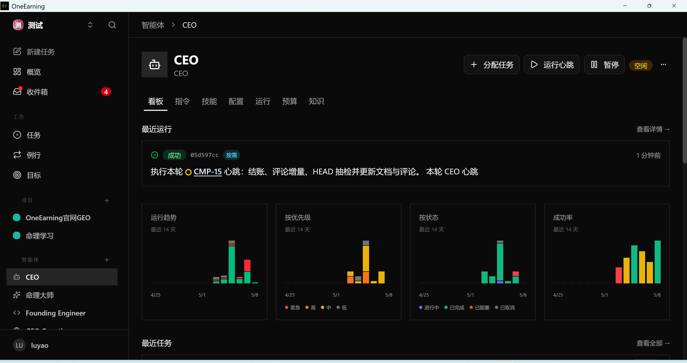
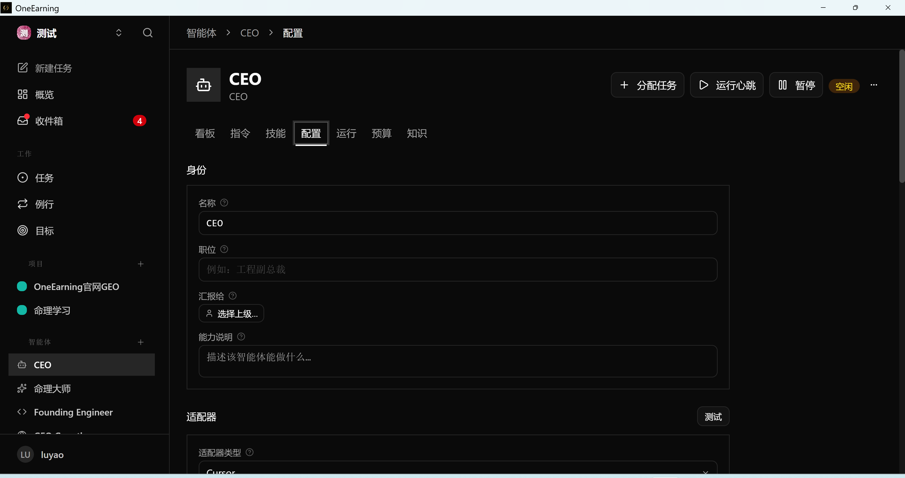
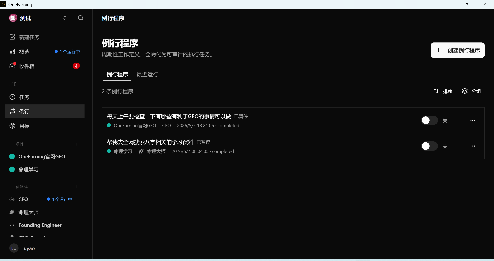
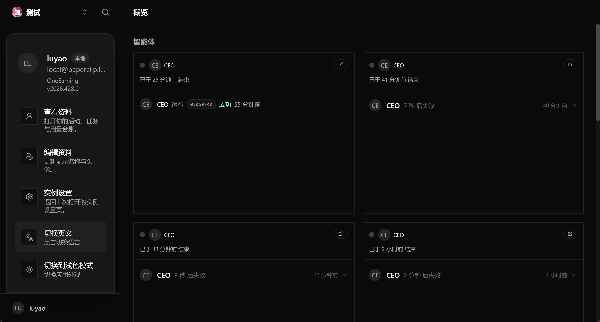
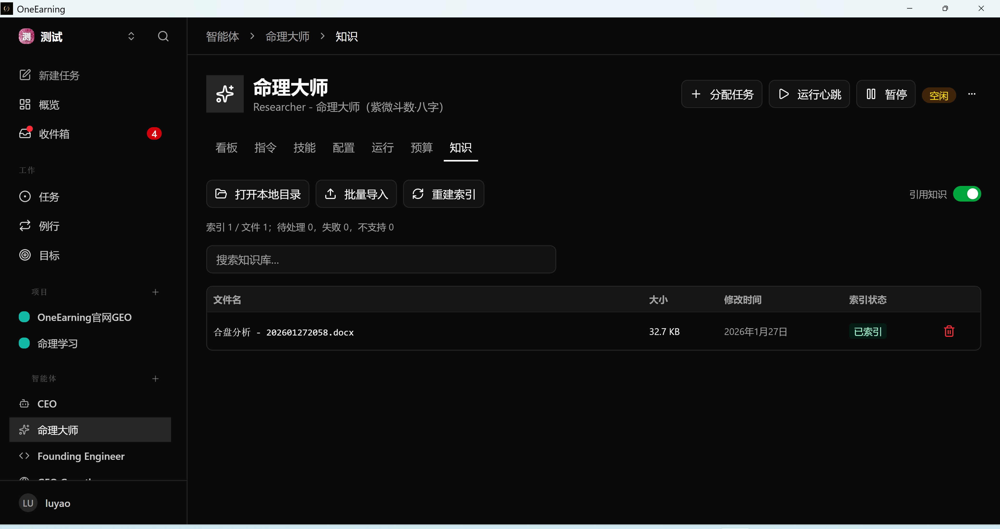
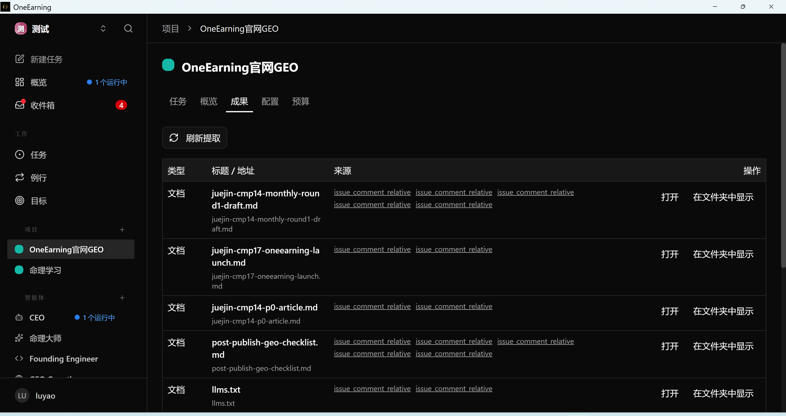
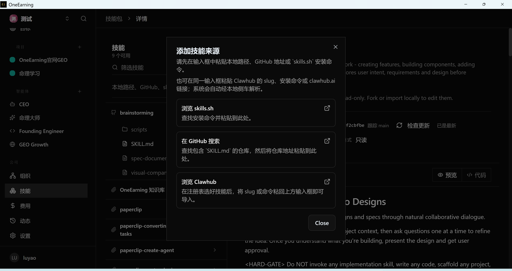

# OneEarning

**The desktop shell for Paperclip — local-first “one-person company” workflows.**

[Overview](#overview) • [Screenshots](#screenshots) • [Why OneEarning](#why-oneearning) • [Differentiation](#differentiation) • [Features](#features) • [Getting Started](#getting-started) • [Architecture](#architecture) • [Use Cases](#use-cases) • [Development](#development) • [Contributing](#contributing) • [Community](#community)

**Languages:** English · [简体中文 (Chinese)](README.zh-CN.md)

**Official site:** [earninghub.ai/one](https://earninghub.ai/one/) · **Installers:** [GitHub Releases](https://github.com/luyao-inc/OneEarning/releases)

---

## Overview

**OneEarning** is a **local-first desktop application** (Electron) that wraps **[Paperclip](https://github.com/paperclipai/paperclip)**—bringing issues, projects, agents & adapters, routines, plugins & skills, organization controls, approvals, and dashboards into **one window**. Your workflow data stays on the machine by default.

**Beyond upstream Paperclip**, OneEarning ships **bilingual UI**, a **knowledge base** sidecar, **project outcomes (成果)**, and **Clawhub** skill-registry integration—see **[Differentiation](#differentiation)** for a structured breakdown (and [`servers/README.md`](servers/README.md) for HTTP routing).

The UI defaults to **Chinese**; switch languages via **Switch to English** / **切换中文** in the **sidebar account menu**, or adjust locale under **Data & storage**.

> This README is structured for humans and for retrieval (search engines, docs mirrors, and AI summaries).

---

## Screenshots

Gallery assets live under [`intro/`](intro/). **Differentiation** features (including **`language.png`** for bilingual UI, plus knowledge, outcomes, and Clawhub skills) are shown under **[Differentiation → UI previews](#ui-previews-intro)** so they stay next to the capability tables. Below: other product surfaces.

### Overview & inbox





### Tasks



### Agents





### Routines



---

## Why OneEarning

Paperclip is powerful, but you may not want to live in a terminal or stitch together separate tools. OneEarning’s philosophy is simple: **give the upstream workflow a first-class desktop home** without forking the core.

| Challenge | OneEarning’s approach |
|-----------|------------------------|
| Scattered context | One app for issues, agents, routines, and org surfaces tied to your workspace |
| “Where is my data?” | Local-first by default; optional **Web escape hatch** opens the same instance in a browser ([doc](docs/escape-hatch.md)) |
| Keeping up with Paperclip | Ships **`paperclipai`** as the upstream runtime in a child process; **this repo does not fork Paperclip source** |

### Paperclip inside

OneEarning runs **`paperclipai`** as a supervised subprocess and exposes the Paperclip HTTP API on localhost. The **main window** is OneEarning’s **React** shell; the **Electron main process** bridges **IPC** to `http://127.0.0.1:<port>/api/...` so the desktop UI stays aligned with the same API surface Paperclip expects.

---

## Differentiation

OneEarning **does not replace** **`paperclipai`**; it **adds** a desktop shell and **local sidecars** that are proxied under **`/api/oneearning/...`** (dynamic localhost ports; see [`servers/README.md`](servers/README.md)).

### Product capabilities (vs upstream Paperclip UI/runtime alone)

| Differentiator | What you get | Where it is implemented |
|----------------|----------------|-------------------------|
| **Bilingual UI** | Switch **Chinese / English** for the full product UI (default Chinese) | Electron shell + i18n; **sidebar account menu** (**Switch to English**, etc.) and **Data & storage** |
| **Knowledge base** | Ingest and query **project-linked knowledge** inside the app | Sidecar [`servers/knowledge`](servers/knowledge/) · HTTP **`/api/oneearning/knowledge/*`** |
| **Project outcomes (成果)** | **Deliverables / retrospectives** at project level | Sidecar [`servers/outcomes`](servers/outcomes/) · HTTP **`/api/oneearning/outcomes/*`** |
| **Clawhub skills** | Use skills from the public registry (**`clawhub.ai`**, same metadata/zip contract as the official **`clawhub` CLI**) alongside Paperclip flows | Sidecar [`servers/clawhub`](servers/clawhub/) · HTTP **`/api/oneearning/clawhub/*`** |

### UI previews (intro)

Structured mapping of **differentiation** items to repo screenshots (for GEO and quick scanning).

| Differentiator | `intro/` asset | Preview |
|----------------|----------------|---------|
| **Bilingual UI** | `language.png` |  |
| **Knowledge base** | `kb.png` |  |
| **Project outcomes (成果)** | `outcome.png` |  |
| **Clawhub skills** | `skill.png` |  |

### Request routing (summary)

| Prefix | Sidecar |
|--------|---------|
| `/api/oneearning/knowledge/*` | Knowledge service |
| `/api/oneearning/outcomes/*` | Outcomes service |
| `/api/oneearning/clawhub/*` | Clawhub registry client |

Everything else for core Paperclip behavior continues to go through the **`paperclipai`** child process and its documented API.

---

## Features

The sections below describe the **full product surface** (upstream Paperclip capabilities **plus** the [differentiators](#differentiation) above).

### Issues & projects

Track work tied to workspaces and repositories—issues, projects, and execution context in one place.

### Agents & adapters

Configure **adapters** for coding assistants and gateways (available adapters depend on the build). Agents stay manageable from the desktop UI instead of ad hoc CLI switches.

### Routines

**Cron-style automation**: scheduled and triggered jobs so recurring work does not depend on you remembering to click.

### Plugins & skills

Extend behavior with plugins and **skills**; where supported, MCP-style integrations plug into the same workflow.

### Org & approvals

Members, invites, permissions, and **approval flows** for teams that still want a small footprint.

### Dashboard

Operational views for tasks, usage/cost signals, and pending approvals—see whether the system needs attention.

### Web escape hatch

Open the **full Web UI** for the same local instance in your system browser when you prefer tabs or a second screen ([escape hatch](docs/escape-hatch.md)).

---

## Getting Started

### System requirements

- **OS:** Windows / macOS / Linux—check [Releases](https://github.com/luyao-inc/OneEarning/releases) for published artifacts per platform.
- **RAM:** 4 GB minimum (8 GB recommended for comfortable development alongside Electron).
- **Disk:** enough space for the app bundle, embedded assets, and local Paperclip data.

### Install (recommended)

Download the latest installer for your platform from **[GitHub Releases](https://github.com/luyao-inc/OneEarning/releases)**.

### Build from source

```bash
git clone https://github.com/luyao-inc/OneEarning.git
cd OneEarning
pnpm install
pnpm dev
```

### First launch (development)

On first run, OneEarning prepares configuration under `userData/paperclip`, runs **`paperclipai doctor`**, then **`paperclipai run`**. Development hosts need **Node.js 20+** (native modules such as `embedded-postgres` target a compatible ABI).

### Production-style bundle

```bash
pnpm run bundle:paperclip   # build/paperclip/
pnpm run bundle:postgres      # optional embedded Postgres payload
pnpm run build               # vite + bundle + electron-builder
```

Windows installer **bundles Node** by default: `pnpm run build:win` runs **`prep:node:win`** first, then packages—users need not install Node. To re-download Node only: `pnpm run prep:node:win`.

```bash
pnpm run build:win
```

### Configuration

- **Update feed:** `ONEEARNING_UPDATE_URL` or `publish` in `electron-builder.yml`.
- **Node binary override:** `ONEEARNING_NODE=/path/to/node`.

---

## Architecture

OneEarning separates **desktop chrome** from **Paperclip runtime**: Electron owns the window and IPC bridge; Paperclip owns API semantics and persistence.

```
┌─────────────────────────────────────────────────────────────┐
│                    OneEarning (Electron)                       │
│  ┌───────────────────────────────────────────────────────┐  │
│  │ Main process                                           │  │
│  │ • Window lifecycle, IPC, proxy to localhost API        │  │
│  └───────────────────────────┬─────────────────────────────┘  │
│                              │ IPC                            │
│  ┌───────────────────────────▼─────────────────────────────┐  │
│  │ Renderer (React shell)                                  │  │
│  │ • Paperclip-facing UI routes & desktop integration      │  │
│  └───────────────────────────────────────────────────────┘  │
└──────────────────────────────┬──────────────────────────────┘
                               │ http://127.0.0.1:<port>/api/...
                               ▼
┌─────────────────────────────────────────────────────────────┐
│ paperclipai (child process) · upstream Paperclip runtime      │
└─────────────────────────────────────────────────────────────┘
```

### Design notes

- **No fork:** upstream `paperclipai` remains the source of truth for server behavior.
- **IPC boundary:** the renderer talks to Paperclip through paths the main process exposes—consistent with local-first security assumptions for a desktop shell.

---

## Use Cases

### Solo operator

Run issues, agents, and routines from one desktop—minimal context switching between “planning” and “doing.”

### Small team governance

Use org features and approvals when more than one person touches agents, spend, or sensitive workflow.

### Integration-heavy workflows

Adapters and skills let you route work to the coding tools you already use while Paperclip stays the coordination layer.

---

## Development

### Prerequisites

- **Node.js:** 20+
- **pnpm:** 9+ (see `packageManager` in `package.json`)

### Repository layout (high level)

```text
OneEarning/
├── electron/           # Main process, preload, IPC / proxy to Paperclip
├── src/                # React renderer (Paperclip UI shell & integrations)
├── servers/            # Auxiliary local services (e.g. knowledge, outcomes)
├── scripts/            # Bundle, vendor, and packaging helpers
├── docs/               # Deep-dive docs (e.g. Web escape hatch)
└── intro/              # README screenshots
```

### Common commands

```bash
pnpm dev              # Vite dev server + Electron
pnpm run build:vite   # Frontend build only
pnpm run package      # Bundle Paperclip + servers + assets (pre-package step)
pnpm run build        # Full production package (electron-builder)
pnpm run typecheck    # TypeScript --noEmit
```

Platform-specific packaging: `pnpm run build:win` · `pnpm run build:mac` · `pnpm run build:linux`.

---

## Contributing

Contributions are welcome—bug fixes, docs, translations, and small focused improvements all help.

1. **Fork** the repository  
2. **Branch** from `main` (`feature/…` or `fix/…`)  
3. **Commit** with clear messages  
4. **Open a Pull Request** describing user-visible impact  

Keep changes scoped; match existing style and run **`pnpm run typecheck`** when you touch TypeScript.

---

## Acknowledgments

- **[Paperclip](https://github.com/paperclipai/paperclip)** / **`paperclipai`** — coordination runtime and API  
- **[Electron](https://www.electronjs.org/)** — cross-platform desktop shell  
- **[React](https://react.dev/)** — renderer UI

Upstream dependencies remain under their respective licenses.

---

## Community

WeChat group for OneEarning users and contributors:


---

## License

OneEarning is released under the **[MIT License](LICENSE)**. Third-party and Paperclip-related packages follow their own license terms.
